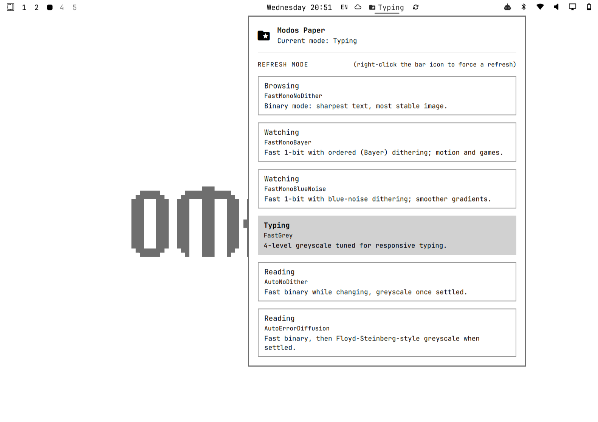

# Modos E-Ink Omarchy plugin

This plugin controls the refresh mode of a Modos Paper Dev Kit 13-inch display
through the Caster/Glider controller's USB HID interface. USB-C DisplayPort Alt
Mode remains the video path; the HID interface is a separate control path.

The plugin is written for Omarchy 4 (Quattro) and its single long-lived
`omarchy-shell` Quickshell process. It declares one headless service and one bar
widget. The service owns the helper process, device state, and polling. The bar
widget renders the compact status label and hosts the panel used to choose a
mode.

## Screenshot



## Current behavior

The bar label is an e-ink glyph followed by the last mode successfully selected.
The current upstream API has no command for reading the controller's mode back,
so this value is persisted locally in
`~/.local/state/modos-eink/state.json`. It is explicitly reported as
`modeSource: local-state` by the helper rather than being presented as hardware
read-back.

Interactions are intentionally simple:

- Left-click opens the panel. The panel shows the current option, every
  available mode (human label plus technical name), and a short explanation.
  Click a row to apply it.
- Right-click forces a hard full-screen redraw (black-to-white flash) to clear
  ghosting — the same behaviour as the Dev Kit's third physical button. It does
  not change the refresh mode.
- Keyboard navigation inside the panel uses arrow keys and Enter; Escape closes
  it. Scrolling the bar widget has no action.

Mode naming: the device's own on-screen menu presents four presets
(*Browsing, Typing, Reading, Watching*), while glider-api exposes six finer
grained `Mode` enum values. No authoritative enum-to-preset table exists in
the SDK or Modos' published material, so the panel shows both: the preset-style
human label as the primary line and the underlying enum name underneath. See
"Mode mapping" below.

The panel uses Omarchy's `KeyboardPanel`, `PanelKeyCatcher`, `Button`,
`BorderSurface`, `Color`, and `Style` components, so its colors, spacing, fonts,
hover state, selection state, and popup surface follow the active theme.

## Files

| File | Purpose |
| --- | --- |
| `manifest.json` | Omarchy schemaVersion 1 manifest; service + bar-widget kinds. |
| `Service.qml` | Long-lived singleton; polls `modosctl status` every 15 seconds, runs mode changes, and forces redraws. |
| `BarWidget.qml` | Compact bar label, click handling, and `Panel.qml` loader. |
| `Panel.qml` | Theme-aware mode picker with human + technical names and keyboard navigation. |
| `modosctl` | Launcher that prefers the documented Python virtualenv. |
| `modosctl.py` | VID/PID detection, JSON status, glider-api mode setter, and full-screen redraw. |
| `udev/69-modos-glider.rules` | Persistent non-root access for the raw HID node. |

## Hardware and API facts

The checked-out upstream source is `~/github/glider-api` pinned to the
immutable commit `b80cd7ed2ea16b5f93800ba1fb4ea75465acf04d` ("sdk-developer-readiness") —
the exact snapshot this plugin is built and validated against. Its standard
Glider configuration is:

- USB vendor ID: `0x1209`
- USB product ID: `0xae86`
- panel geometry: 1600 × 1200

The supported public `Mode` enum currently has these usable values, paired
below with the preset-style human label shown in the panel:

| Mode (technical) | Panel label | Intended use |
| --- | --- | --- |
| `FastMonoNoDither` | Browsing | Fastest hard black/white, sharpest text, most stable image. |
| `FastMonoBayer` | Watching | Fast mono with ordered (Bayer) dithering; motion and games. |
| `FastMonoBlueNoise` | Watching | Fast mono with smoother, less structured dithering. |
| `FastGrey` | Typing | Four-level greyscale tuned for responsive text editing. |
| `AutoNoDither` | Reading | Fast binary while changing, greyscale once settled. |
| `AutoErrorDiffusion` | Reading | Hybrid with Floyd-Steinberg-style diffusion when settled. |

### Mode mapping

The on-device quad presets (*Browsing / Typing / Reading / Watching*) are
firmware-level combinations; the SDK only exposes the raw `Mode` enum. The
labels above are derived from the technical traits that Modos' own marketing
and the Tom's Hardware hands-on (`Browsing` = binary + edge-detected text,
`Typing` = 4-level greyscale, `Reading` = Floyd-Steinberg hybrid,
`Watching` = speed-oriented dithered modes) describe — no single authoritative
table exists, so the panel always shows the enum name as a secondary line
rather than presenting the label as the device's exact read-out.

The API does not currently expose contrast, brightness/lightness, gamma, or a
front-light/backlight control (confirmed against `src/lib.rs`, the generated
`include/glider-api.h`, and every open branch of the Modos-Labs repo). This
13-inch monochrome Dev Kit has no front light, so no such control is shown and
none would function. A mode getter is also absent, so the plugin does not
invent read-back for those values.

## Installation

Install the plugin from git and enable it:

```sh
omarchy plugin add https://github.com/cittadhammo/omarchy-modos-eink.git --enable
```

This places it in Omarchy's local discovery path (and adds the hot-reload
watcher described later). Now install the Rust build prerequisite and compile
the Python extension into the venv used by the included launcher:

```sh
sudo pacman -S --needed rust pkgconf
git clone https://github.com/Modos-Labs/glider-api ~/github/glider-api
git -C ~/github/glider-api checkout b80cd7ed2ea16b5f93800ba1fb4ea75465acf04d
python3 -m venv ~/.local/share/modos-eink/venv
PYO3_USE_ABI3_FORWARD_COMPATIBILITY=1 \
  ~/.local/share/modos-eink/venv/bin/pip install ~/github/glider-api
```

The `git checkout` line pins `glider-api` to an immutable commit SHA so every
install builds exactly the code this plugin was reviewed against. To update
`glider-api` later, move the pin forward deliberately: checkout a newer commit
in that repository, rerun the `pip install` above, retest, and bump the SHA in
this file and in `modosctl.py`.

The compatibility flag is needed on Python 3.14 and later, which is newer than
the PyO3 0.24 version guard (which stops at Python 3.13). A Python 3.13
virtualenv may be used instead. To use another interpreter, set
`MODOS_EINK_PYTHON` in the environment that starts `omarchy-shell`.

Install the HID rule. The `69-` prefix is deliberate: it runs after udev has
populated `ID_VENDOR_ID`/`ID_MODEL_ID` and before systemd's `uaccess` helper
runs. This system has no `plugdev` group, so the rule uses the active-session
ACL rather than assuming that group exists.

```sh
sudo rm -f /etc/udev/rules.d/99-modos-glider.rules
sudo install -m 0644 \
  ~/.config/omarchy/plugins/cittadhammo.modos-eink/udev/69-modos-glider.rules \
  /etc/udev/rules.d/69-modos-glider.rules
sudo udevadm control --reload-rules
sudo udevadm trigger --action=add --subsystem-match=hidraw
sudo udevadm settle
```

If the ACL is not added, unplug and reconnect the USB-C cable. Verify the
device and active-user access:

```sh
lsusb -d 1209:ae86
ls -l /dev/hidraw*
getfacl /dev/hidraw0
```

The ACL should contain `user:<your-user>:rw-`. Do not use a permanent manual
`chmod`; the udev rule is the persistent solution.

The `--enable` flag on `omarchy plugin add` already places the widget in the
bar; move it to an explicit section if desired:

```sh
omarchy plugin validate ~/.config/omarchy/plugins/cittadhammo.modos-eink
omarchy plugin enable cittadhammo.modos-eink --section center --after omarchy.weather
omarchy plugin list --json
```

## Verifying the helper

The helper always emits one JSON object on stdout and a useful human-readable
diagnostic on stderr when it fails. Exit status is zero only for success.

```sh
~/.config/omarchy/plugins/cittadhammo.modos-eink/modosctl status
~/.config/omarchy/plugins/cittadhammo.modos-eink/modosctl set-mode FastGrey
~/.config/omarchy/plugins/cittadhammo.modos-eink/modosctl redraw
~/.config/omarchy/plugins/cittadhammo.modos-eink/modosctl status
```

`status` checks the VID/PID, verifies read/write access to the matching
`/dev/hidraw*` node, imports `glider_api`, and opens the HID device. `set-mode`
uses the full-screen rectangle from `DisplayConfig.glider_standard()` and only
writes the state file after the API call succeeds. `redraw` calls the API's
`Display.redraw(full_screen())` — a hard black-to-white flash that clears
ghosting without touching the mode — and never writes state.

Expected failure messages identify one of: missing device, missing HID ACL,
missing Python binding, unknown mode, or a controller/API communication error.

## Development and hot reload

Files under `~/.config/omarchy/plugins/` are watched by the running shell. Save
a QML file and the plugin is rescanned automatically. If it does not update:

```sh
omarchy-shell shell rescanPlugins
```

For a definitive component-cache reset:

```sh
omarchy restart shell
```

Validate before publishing:

```sh
omarchy plugin validate ~/.config/omarchy/plugins/cittadhammo.modos-eink
```

To inspect QML load errors, find the running shell and read its log:

```sh
quickshell list --all
quickshell log --id <instance-id> --tail 150
```

The live widget is intentionally not added by editing `shell.json` manually;
`omarchy plugin enable` owns the placement and keeps it in the configured bar
layout.

## Extending modes

When a newer `glider-api` adds a supported mode:

1. Confirm its exact Python enum spelling in `src/lib.rs` and the Python mode
   guide; do not guess the name.
2. Add that exact spelling to `MODE_NAMES` in `modosctl.py`.
3. Add its human label and description to `MODE_LABELS` and
   `MODE_DESCRIPTIONS` in `modosctl.py`, which are emitted to the QML layer as
   `modeLabels`/`modeDescriptions`. `Panel.qml`'s `description()` merely
   forwards to the service and needs no edit.
4. Reinstall the API if its native binding changed.
5. Run `omarchy plugin validate`, then rescan the shell.

The QML picker consumes the helper's JSON `modes`, `modeLabels`, and
`modeDescriptions` fields, so no model or repeater change is necessary for the
normal case.

## Publishing

The canonical repository for this plugin is:

```sh
omarchy plugin add https://github.com/cittadhammo/omarchy-modos-eink.git --enable
```

This directory is the repository itself (see the top "Installation" section
for the full setup). To publish an update, just commit and push here; there is
no plugin registry to upload to — `omarchy plugin add` installs straight from
the git URL, and `omarchy plugin update <id>` pulls newer commits on installed
machines.

Keep the udev rule in the repository and document that installing it under
`/etc/udev/rules.d/` requires administrator access. The plugin itself never
uses sudo.

## Removal

Remove the plugin, the HID rule it installed, and its local data:

```sh
omarchy plugin remove cittadhammo.modos-eink --yes
sudo rm -f /etc/udev/rules.d/69-modos-glider.rules
sudo udevadm control --reload-rules
rm -rf ~/.local/share/modos-eink
rm -f ~/.local/state/modos-eink/state.json
```

The plugin never touches user configuration, so a proper removal restores the
pre-install state. The Python venv under `~/.local/share/modos-eink/venv/` and
the local `glider-api` checkout under `~/github/glider-api/` were installed for
this plugin; delete them too if nothing else uses them.
